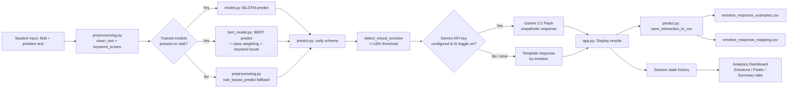

# Data Flow Diagram

## Level 0 — Context Diagram

```
                +-------------------+
   Student ---> |  Streamlit UI     | ---> Guidance + Analytics ---> Student
   (field,      |   (app.py)        |
   problem)     +-------------------+
```

## Level 1 — Detailed Flow



## Data Stores

| Store | Written by | Read by |
|---|---|---|
| `emotion_response_examples.csv` | `predict.save_interaction_to_csv()` | `predict.load_csv_examples()`, sidebar metrics |
| `emotion_response_mapping.csv` | `predict._upsert_mapping()` | Optional "use CSV examples" mode in `app.py` |
| Streamlit `session_state.history` | `app.py` per interaction | Analytics dashboard (Plotly charts) |
| `Users` / `Emotion_Records` (future DB path) | Optional auth/API layer | Multi-user hosted deployment (see `schema.sql`) |
